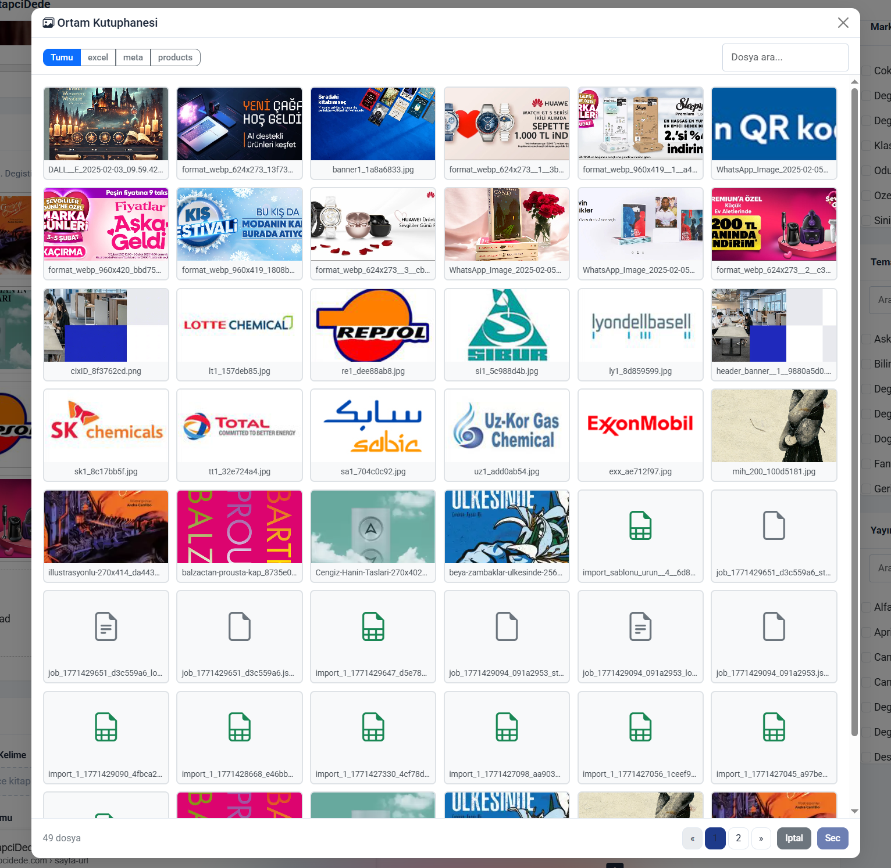
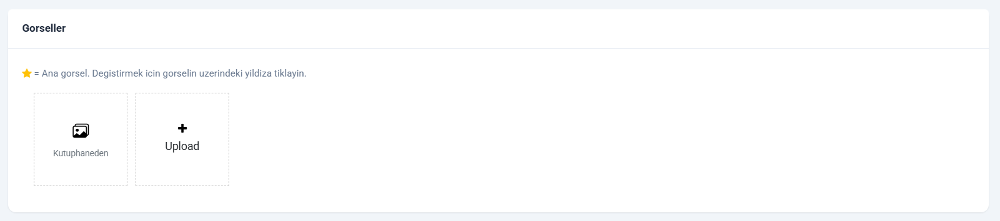
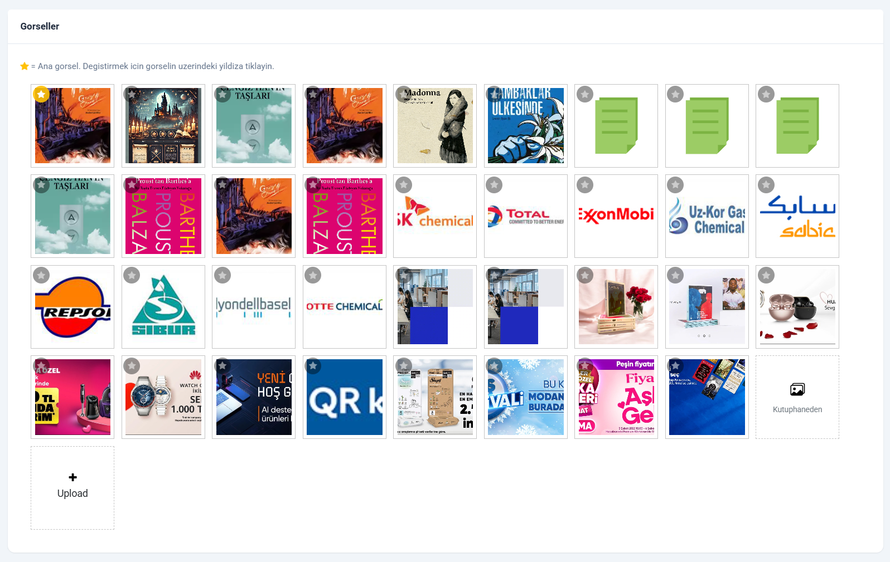
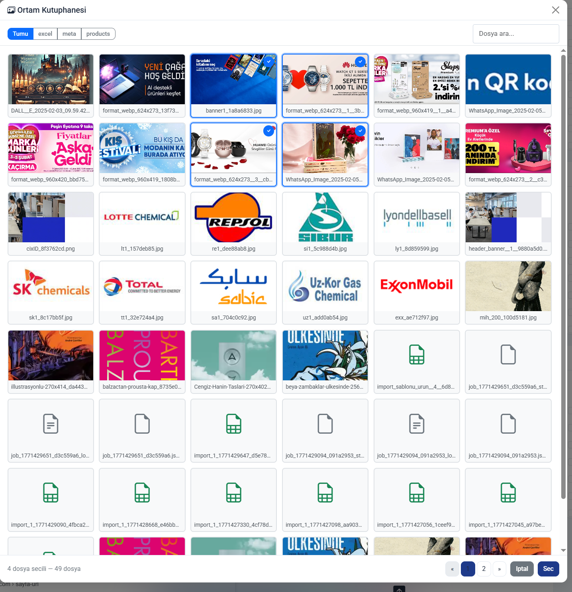

<h1 align="center">jQuery Media Library</h1>

<p align="center">
  <strong>A beautiful media browser modal for jQuery file uploaders.</strong><br>
  Browse, search, and reuse previously uploaded files — without re-uploading.
</p>

<p align="center">
  <a href="LICENSE"></a>
  
  
  
</p>

<p align="center">
  <a href="https://raca12.github.io/jquery-media-library/"></a>
</p>

<p align="center">
  
</p>

---

## The Problem

Every file uploader lets you **upload new files**. But what about files you've **already uploaded**?

Users re-upload the same logo, the same product photo, the same PDF — over and over. There's no way to browse what's already on the server and pick from it.

**jQuery Media Library** solves this with a single JS file:

- **Beautiful modal** — responsive grid, lazy-loaded thumbnails, file type icons
- **Search & filter** — by filename and folder, with 300ms debounce
- **Single or multi-select** — toggle with one option
- **Auto-hooks into jQuery uploaders** — adds a "Media Library" button automatically
- **Backend agnostic** — works with PHP, Node.js, Python, Go — anything that returns JSON
- **~10KB minified** — no dependencies beyond jQuery + Bootstrap 5

---

## Demo

**[Live Demo](https://raca12.github.io/jquery-media-library/)** — Try it in your browser right now. No setup needed.

> The live demo uses mock data with placeholder images — no real backend required. In production, it connects to your own API endpoint and shows your actual uploaded files.

https://github.com/raca12/jquery-media-library/raw/main/screenshots/Recording.mp4

> *Full workflow: open modal, browse files, select multiple, insert into uploader — zero re-uploads.*

## Screenshots

| Uploader Button (Empty) | Uploader with Files |
|:-:|:-:|
|  |  |

| Media Library Modal | Multi-Select |
|:-:|:-:|
|  |  |

---

## Installation

### CDN (Fastest)

```html
<!-- Required: jQuery 3.x + Bootstrap 5.x -->
<link href="https://cdn.jsdelivr.net/npm/bootstrap@5.3.3/dist/css/bootstrap.min.css" rel="stylesheet">
<link href="https://cdn.jsdelivr.net/npm/bootstrap-icons@1.11.3/font/bootstrap-icons.min.css" rel="stylesheet">
<script src="https://cdn.jsdelivr.net/npm/jquery@3.7.1/dist/jquery.min.js"></script>
<script src="https://cdn.jsdelivr.net/npm/bootstrap@5.3.3/dist/js/bootstrap.bundle.min.js"></script>

<!-- Media Library -->
<script src="https://cdn.jsdelivr.net/npm/jquery-media-library/dist/media-library.min.js"></script>
```

### npm

```bash
npm install jquery-media-library
```

### Manual Download

Download [`media-library.min.js`](dist/media-library.min.js) (10KB) and include it after jQuery and Bootstrap.

---

## Quick Start

### 1. Add the script (after jQuery + Bootstrap)

```html
<script src="media-library.min.js"></script>
```

### 2. Configure your API endpoint

```javascript
MediaLibrary.defaults.apiUrl = '/api/media-list';
```

### 3. Open the modal

```javascript
$('#browse-btn').on('click', function () {
    MediaLibrary.open({
        multiple: true,
        onSelect: function (files) {
            // files = [{ url: '/uploads/photo.jpg', name: 'photo.jpg' }, ...]
            console.log('Selected:', files);
        }
    });
});
```

That's it. Three lines of code.

---

## API Reference

### `MediaLibrary.open(options)`

Opens the media browser modal.

| Option | Type | Default | Description |
|--------|------|---------|-------------|
| `multiple` | `boolean` | `false` | Allow selecting multiple files |
| `folder` | `string` | `''` | Pre-select a folder tab |
| `onSelect` | `function` | `null` | Callback with selected files: `function(files)` where `files = [{url, name}]` |
| `apiUrl` | `string` | — | Override API endpoint for this call |
| `ajaxData` | `object` | `{}` | Extra query params for this call |
| `ajaxHeaders` | `object` | `{}` | Extra headers (e.g., `{ Authorization: 'Bearer ...' }`) |

### `MediaLibrary.defaults`

Global configuration. Set these once before any `.open()` call:

```javascript
MediaLibrary.defaults.apiUrl = '/api/media-list';
MediaLibrary.defaults.title = 'Choose a file';
MediaLibrary.defaults.perPage = 48;
MediaLibrary.defaults.selectText = 'Select';
MediaLibrary.defaults.cancelText = 'Cancel';
MediaLibrary.defaults.allText = 'All';
MediaLibrary.defaults.searchPlaceholder = 'Search files...';
MediaLibrary.defaults.emptyText = 'No files found';
MediaLibrary.defaults.errorText = 'Error loading files';
MediaLibrary.defaults.fileInfoText = '{count} files';
MediaLibrary.defaults.selectedInfoText = '{selected} selected — {count} files';
MediaLibrary.defaults.uploaderButtonText = 'Media Library';
MediaLibrary.defaults.uploaderButtonIcon = 'bi bi-images';
MediaLibrary.defaults.ajaxHeaders = { 'X-CSRF-TOKEN': 'your-token' };
MediaLibrary.defaults.ajaxData = { _token: 'csrf-value' };
```

### Callback: `onSelect(files)`

```javascript
// Single select → files.length === 1
// Multi select  → files.length >= 1

files = [
    { url: '/uploads/products/photo.jpg', name: 'photo.jpg' },
    { url: '/uploads/docs/report.pdf', name: 'report.pdf' }
];
```

---

## Backend API

Your backend must respond to a GET request with JSON. The plugin sends:

```
GET /api/media-list?folder=products&search=photo&page=1
```

And expects:

```json
{
    "files": [
        {
            "url": "/uploads/products/photo.jpg",
            "name": "photo.jpg",
            "type": "image",
            "size": 102400,
            "modified": "2026-02-15"
        }
    ],
    "folders": ["products", "avatars", "documents"],
    "current_folder": "products",
    "total": 128,
    "page": 1,
    "pages": 3
}
```

### File Object

| Field | Type | Description |
|-------|------|-------------|
| `url` | `string` | **Required.** Public URL to the file |
| `name` | `string` | **Required.** Filename for display |
| `type` | `string` | `"image"` or `"document"` — determines thumbnail vs icon |
| `size` | `number` | File size in bytes (used in tooltip) |
| `modified` | `string` | Last modified date (for display) |

### Backend Examples

Ready-to-use backend implementations:

| Language | File | Framework |
|----------|------|-----------|
| PHP | [`examples/php/media-list.php`](examples/php/media-list.php) | Vanilla PHP |
| Node.js | [`examples/node/media-list.js`](examples/node/media-list.js) | Express.js |

> **Security Tip:** Always add authentication to your endpoint. The examples include placeholder comments showing where to add auth checks.

---

## jQuery Uploader Integration

The killer feature: **automatic integration with jQuery file uploaders.**

If you use a jQuery uploader plugin that triggers `uploader-init` events (like [jquery-uploader](https://github.com/nicatro/jquery-uploader)), the Media Library button appears automatically:

```
┌─────────────────────────────────────────────┐
│                                             │
│  ┌───────┐  ┌───────┐  ┌─────────┐  ┌───┐  │
│  │ img1  │  │ img2  │  │ Media   │  │ + │  │
│  │       │  │       │  │ Library │  │   │  │
│  └───────┘  └───────┘  └─────────┘  └───┘  │
│                                             │
└─────────────────────────────────────────────┘
         ↑ existing files    ↑ browse     ↑ upload new
```

### How It Works

1. **Auto-detection:** Listens for `uploader-init` events on `<input>` elements
2. **Button injection:** Adds a "Media Library" button next to the upload button
3. **Seamless insert:** Selected files are added to the uploader's file list with `status: 'initial'` — no re-upload needed
4. **Survives re-renders:** The button is re-injected after every `refreshPreviewFileList()` call via method wrapping

### Manual Integration

If your uploader doesn't trigger `uploader-init`, you can manually wire it:

```javascript
$('#my-upload-input').on('click', '.my-browse-btn', function () {
    MediaLibrary.open({
        multiple: true,
        onSelect: function (files) {
            files.forEach(function (f) {
                // Add file URL to your input
                var current = $('#my-upload-input').val();
                var sep = current ? ',' : '';
                $('#my-upload-input').val(current + sep + f.url);
            });
        }
    });
});
```

---

## Customization

### Custom File Icons

The library uses Bootstrap Icons by default. Override globally:

```javascript
// Before opening the modal
MediaLibrary.defaults.uploaderButtonIcon = 'fa fa-photo-film'; // Font Awesome
```

### Localization

```javascript
MediaLibrary.defaults.title = 'Médiathèque';
MediaLibrary.defaults.selectText = 'Choisir';
MediaLibrary.defaults.cancelText = 'Annuler';
MediaLibrary.defaults.allText = 'Tout';
MediaLibrary.defaults.searchPlaceholder = 'Rechercher...';
MediaLibrary.defaults.emptyText = 'Aucun fichier trouvé';
MediaLibrary.defaults.fileInfoText = '{count} fichiers';
MediaLibrary.defaults.selectedInfoText = '{selected} sélectionné(s) — {count} fichiers';
MediaLibrary.defaults.uploaderButtonText = 'Médiathèque';
```

### Custom Styling

All elements have CSS classes prefixed with `ml-`. Override them after the script loads:

```css
/* Change selection color */
.ml-item.selected { border-color: #e91e63; box-shadow: 0 0 0 2px rgba(233,30,99,.3); }
.ml-item .ml-check { background: #e91e63; }

/* Larger thumbnails */
.ml-item-img { height: 150px; }

/* Different grid columns */
.ml-grid { grid-template-columns: repeat(4, 1fr); }
```

---

## Browser Support

| Browser | Version |
|---------|---------|
| Chrome | 60+ |
| Firefox | 55+ |
| Safari | 12+ |
| Edge | 79+ |
| Opera | 47+ |

---

## Requirements

| Dependency | Version | Required |
|-----------|---------|----------|
| jQuery | 3.0+ | Yes |
| Bootstrap 5 (JS + CSS) | 5.0+ | Yes |
| Bootstrap Icons | 1.0+ | Yes (for file type icons) |

---

## File Structure

```
jquery-media-library/
├── dist/
│   ├── media-library.js          # Full source (22KB)
│   └── media-library.min.js      # Minified (10KB)
├── src/
│   └── media-library.js          # Development source
├── examples/
│   ├── demo.html                 # Interactive demo page
│   ├── php/media-list.php        # PHP backend example
│   └── node/media-list.js        # Node.js backend example
├── screenshots/                  # Screenshots for README
├── package.json
├── LICENSE                       # MIT
└── README.md
```

---

## Contributing

Contributions are welcome! Please:

1. Fork the repository
2. Create a feature branch (`git checkout -b feature/amazing-feature`)
3. Commit your changes (`git commit -m 'Add amazing feature'`)
4. Push to the branch (`git push origin feature/amazing-feature`)
5. Open a Pull Request

---

## Why This Exists

Every admin panel needs a media library. WordPress has one. Strapi has one. But if you're building a custom admin with jQuery + Bootstrap? You're on your own.

This library was extracted from a production multi-tenant e-commerce platform where admins were re-uploading the same product images dozens of times. One JS file later, they could browse and reuse everything.

**Zero config. Zero dependencies beyond jQuery + Bootstrap. Just works.**

---

## License

MIT &copy; [raca12](https://github.com/raca12)

---

<p align="center">
  <sub>If this saved you time, consider giving it a <a href="https://github.com/raca12/jquery-media-library">star</a> ⭐</sub>
</p>
